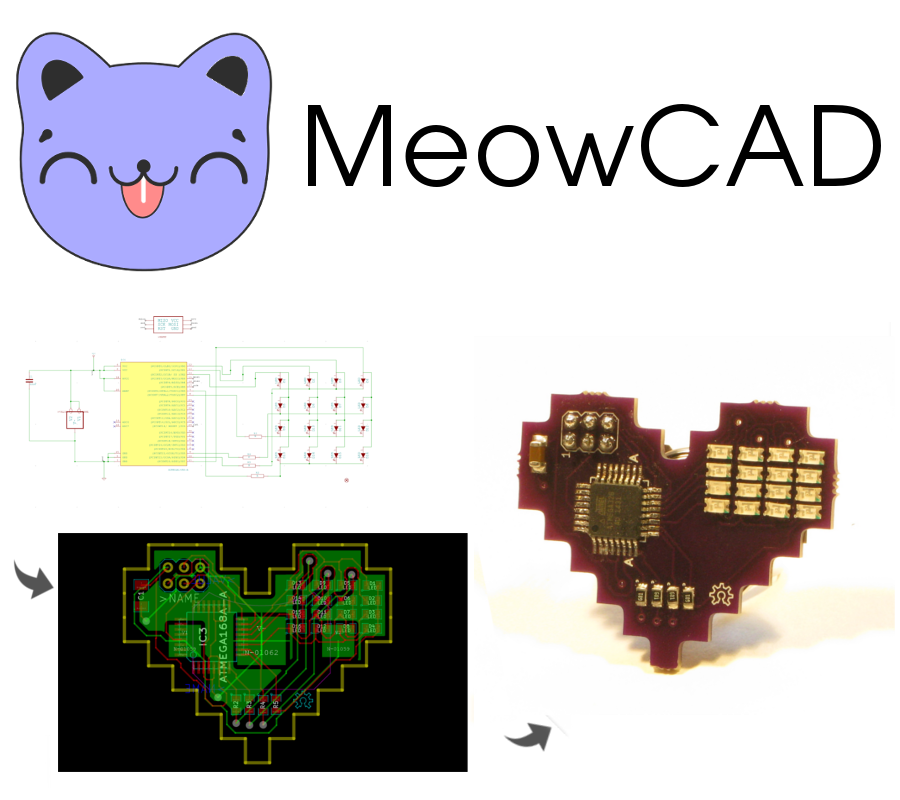
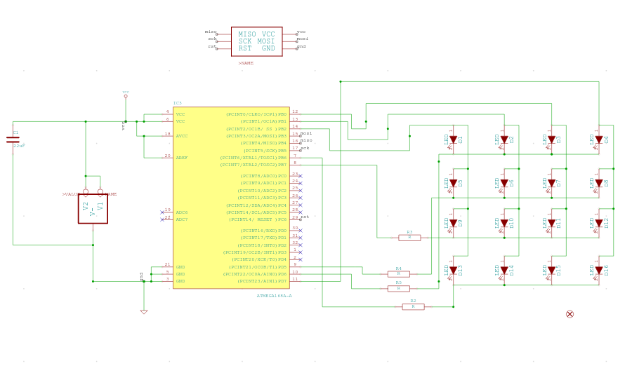
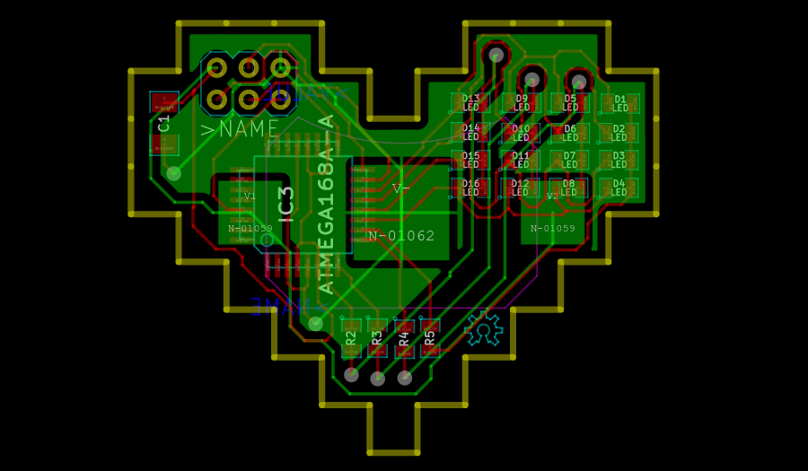
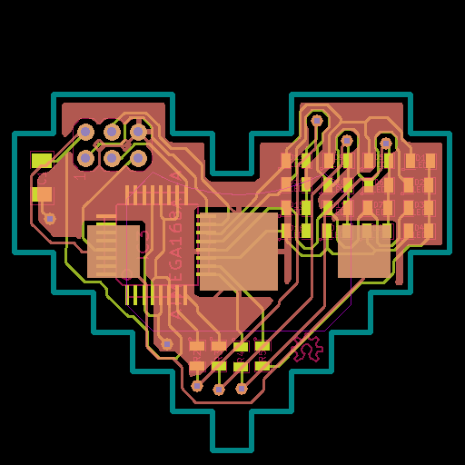

www.meowcad.com
===============

Overview
---

This is the codebase for the website to MeowCAD.  See it live at

[MeowCAD](https://meowcad.com)

MeowCAD is a free and open source online electronics design tool that
runs completely in your browser.

With it, you'll be able to design schematics like this:

and produce board like this:

Once a board is created, it can export the board as Gerber files that will look something like this:

which can be sent to board manufacturers to which will eventually give you boards that look like this:

This codebase only represents the (very hacked together, hodge-podge frameworkless) python code that
powers the website proper.  For the web application that runs the schematic and board capture in your
browser, see the sibling project:

[bleepsix](https://github.com/abetusk/bleepsix)

There's a [screencast available](https://www.youtube.com/watch?v=MWll14sQI-A) (17mins+) that walks through some of the basic functionality of MeowCAD.

Installation
---

Installation is involved and has a lot of dependencies.  There's an old `Dockerfile` present in [config/docker.io/Dockerfile](config/docker.io/Dockerfile) that will get you started.  If there's interest, I will update the Dockerfile to make it in line with the most recent MeowCAD version.  You can check out an older [image of MeowCAD](https://registry.hub.docker.com/u/abetusk/meowcad/) in the Docker registry as well.

Unfortunately this repository (www.meowcad.com) is intertwined with [bleepsix](https://github.com/abetusk/bleepsix).  For example, the node server requires the bleepsix repository to be installed at a pre-defined location.

Feedback
---

Feedback is welcome!  Send me a message (abetusk (at) gmail dot com) or leave some feedback on MeowCAD!

Happy hacking!
