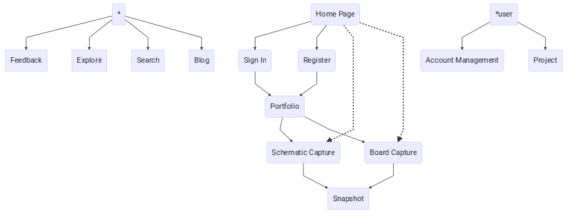

MeowCAD Design Document
===

Overview
---

MeowCAD is an online electronics design tool.  The primary goal of MeowCAD is electronics
schematic capture and board capture for PCB manufacture.  The schematic and board capture
run completely in the client's web browser.  The server runs software to manage client
connections and projects.

This specification is a work in progress.  Please feel free to offer suggestions or improvements
either in the form personal communication or pull requests.

This specification will focus on functional aspects of MeowCAD seen from a user or administrator
of a MeowCAD system.

Example Use Cases
---

To focus discussion, sample scenarios of MeowCAD are given below showing (hypothetical) usage
of MeowCAD.

### Sample Use Case 0: Ash

Ash is just learning electronics and has logged into an electronics chat forum.  Ash
has a circuit in mind but is failing to convey the circuit functionality to other people
who are happy to help.  Ash has the option of downloading and installing other electronics
design capture programs, taking a screenshot, cropping the image then uploading to an image
sharing site.

Instead, Ash goes to MeowCAD.com and quickly sketches the circuit in the schematic capture.
There is no need to register or log in, though this is an option should Ash want to create
more projects or save work.  After the schematic has been quickly drawn out, a 'snapshot' is
taken and, after a quick review, Ash makes it public and shares the MeowCAD snapshot link
to the other people in the channel.

### Sample Use Case 1: Cameron

Cameron has been bread boarding projects for a while and wants to graduate to making a PCB.
There are some options that fall within Cameron's price range but Cameron just wants to
dive in and play around.  After discovering MeowCAD, Cameron has built a small schematic
and board and is ready to submit to a board manufacturer.  Cameron knows that MeowCAD either
has or will support KiCAD export, so Cameron's not worried about creating projects
that can't be migrated.

Maybe Cameron stays with MeowCAD and moves over to something more powerful when a complex
board is needed or maybe Cameron sticks with MeowCAD to see what it can do.  Regardless,
Cameron has graduated from the 'bread boarding' stage of electronics development to
getting familiarity with EDA tools for use in more complex circuit design.

### Sample Use Case 2: Remy

Remy has a small electronics shop.  Remy has a lot of experience with different electronics
design tools and understands the value of free and open source software.  Occasionally
Remy takes in an intern to help out with circuit design.  Remy likes to design parts of the
circuit, give it to the interns then review it and make changes where appropriate.

Having an online solution makes sense because there's no need to transfer the design files.
The interns can alter the project and Remy can review and tweak at will.

Scope
---

Since the schematic capture and board capture portions of MeowCAD are completely in browser,
there are compromises to be made in terms of circuit complexity.
In the future, as browsers get more powerful, or if more engineering effort is devoted to move
heavier computation server side, the possibility of more complicated circuit design could be possible.
MeowCAD is currently focused on small to mid sized circuits with a focus on hobbyists.

KiCAD is an excellent package and can handle large and complex circuits.  MeowCAD is meant to
compliment KiCAD rather than compete.

MeowCAD Web Flowchart
---

There are details that get lost but the following flowchart shows the basic components
of the MeowCAD web interface:

Page Descriptions
---

The flow should be intuitive with the ability to login or register along with standard
account management and different access points to schematic and board capture.
Feedback, project exploration and search are also provided.  Pages are described below.

Special consideration is taken into account for anonymous accounts and will be described
at the end.

### Home Page

This is the main page that users not logged should see.  The primary goal is to
describe what MeowCAD is as succinctly as possible.  There should be an obvious
and intuitive 'call to action' where users can register with ease.  The login option
should be clearly visible and in an intuitive place (for example, the top right).

The schematic and board capture should be able to be viewed immediately without
having to register.  If the schematic or board capture pages are navigated to
without first logging in or registering, an 'anonymous' account will be created.

## Register

A page allowing for user registration.  An email will be asked for but not
required.  If a user is registering without already having an anonymous account
active, a default empty project will be created.

### Sign In

A page allowing for user sign in.  After successful sign in, the user should
be deposited in their 'Portfolio' page.

### Portfolio

A view of each of the users projects will be viewable.  Each project should have
a 'thumbnail' picture of the schematic and board.  Each project in view should
also have a 'download' option available that will export the project.  Projects
can be navigated to individually.

There will be an 'import' feature, exposed as a tab, that will allow for library
component and footprint import via an upload interface.  Each of the library
components and footprints will also be viewable via accordion lists with
thumbnails of each component.

### Project

An individual project can be viewed.
A thumbnail snapshot of the projects schematic and board will be exposed
along with a 'download' button for easy export.  The schematic and board
captures will have links in the project for easy navigability.
A bill of materials (BOM)
tab will be exposed to allow for parts catalog of the project.

If the owner has navigated to the project page,
project management will be exposed (through an alternate tab) to allow
for project description and deletion to occur.  The owner of the project
will also be allowed to add to the bill of materials, set privacy access
(public or private) and delete the project if desired.

Private projects are not viewable by the public.

### Feedback

A page for user submitted feedback.

### Blog

A page that lists blog posts.

### Explore

A page to explore publicly available projects that users have marked as
viewable by the public.  This is a curated list by the site administrator
that can be used to highlight 'trending' projects available for viewing.

Each project will be listed with a thumbnail of their schematic and boards.

### Search

A page to allow for search of projects withing the system.

### Account Management

A page to change the users password, update their information or delete their account.

### Schematic Capture

This is the 'web application' portion of MeowCAD.  The schematic capture will allow
for user schematic content creation.  The schematic capture will have options
for different tools (wires, no-conns, etc.) and a library of component parts to be used
in the schematic.

A 'palette' should be exposed that has a list of commonly used parts for easy access rather
than looking through the library to find the relevant part.  By default this should include
things like resistors, capacitors, NPN and PNP resistors, mosfets and power symbols (+VCC, Gnd).

The library should have a 'search' facility to highlight relevant parts.

The schematic capture should have a 'snaphot' feature to take pictures of the schematic (rendered
as a PNG, for example).

There should be a 'download' button that will export the project.

### Board Capture

This is the other part of the 'web application' portion of MeowCAD.  The board capture will allow
for user board content creation.  The board capture will have options
for different tools (copper tracks, zone pours, board edges, etc.) and a library of footprint parts to be used
in the board.

The footprint library should have a 'search' facility to highlight relevant footprints.

Clearances, trace widths and grid snap sizes should be exposed to the user.

The board capture should have a 'snaphot' feature to take pictures of the schematic (rendered
as a PNG, for example).

There should be a 'download' button that will export the project.

### Snapshot

This page will render a snapshot created by users of the schematic or board portions.  By default
the snapshot should be 'locked' and viewable only by the owner of the project that generated
the picture.  The user should be able to 'unlock' the picture to allow the general public to view.

There should be a 'download' button to easily download the picture locally.

### Anonymous Account

When navigating to the schematic or board portion of MeowCAD without first logging
in or registering, an anonymous account will be created so that users can
interact with the schematic and board portions without registering or logging in.

The anonymous account will allow for persistent state (with a persistent session
stored in a cookie on the client, say) so that projects can be navigated back
to even after the window or tabs have been closed.  Registration from an anonymous
account will allow the project to be ported over.  Anonymous accounts will only
be allowed one project that is private.

Anonymous account sessions can be cleared by navigating to the 'Registration' page
and hitting the 'clear session state' button.  Though this is non intuitive to
the user, this is done explicitly to encourage registration.

Additional Features
---

The above does not cover some of the features relevant to MeowCAD.  This will
be covered briefly here:

* Gerber export for PCB manufacture
* KiCAD export
* KiCAD/Eagle library (component and footprint) import
* KiCAD project import
* GCode export (for use in isolation milling)
* Project forking/copying
* Bill of Materials (BOM) management
* Sub-component copying (copy from one project to another)
* Component and footprint library creation
* Circuit simulation
* Push and shove router
* Autorouter

Current State
---

Currently, the following has been *implemented*:

* MeowCAD basic website prototype, including user, portfolio and project management.
* Schematic and board capture
* Gerber export
* KiCAD library (component and footprint) import
* KiCAD export (preliminary, experimental only)
* GCode export (preliminary, experimental only)

The following features have *not yet been implemented*:

* Eagle library (component and footprint) import
* KiCAD project import
* Project forking/copying
* Bill of Materials (BOM) management
* Sub-component copying (copy from one project to another)
* Component and footprint library creation
* Circuit simulation
* Push and shove router
* Autorouter
